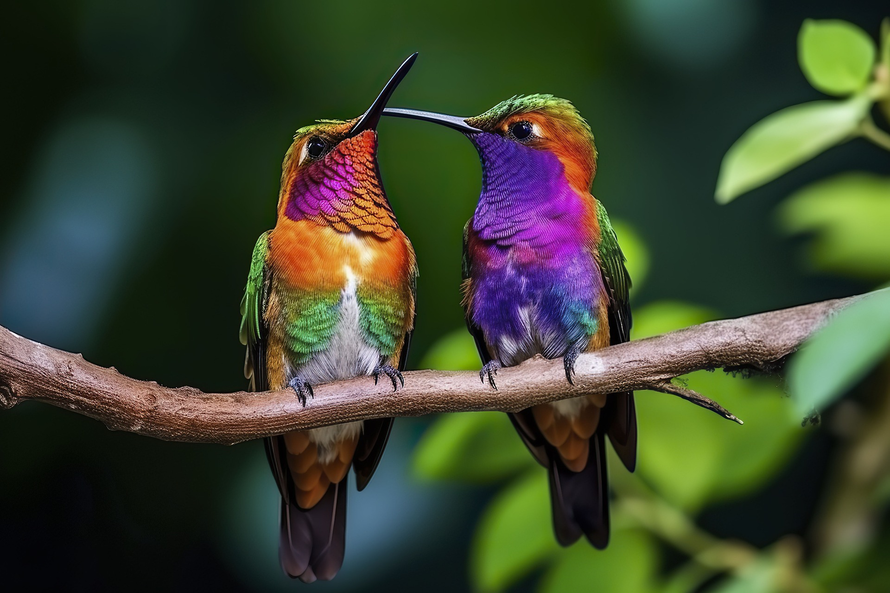

# Hola-Mundo

- Vamos a hacer una prueba para poder volver al estado incial del proyecto
  - Hemos comprobado que podemos descargarnos versiones anteriores y trabajar en ellas

- Vamos a añadir una foto entre el texto

- Vamos a añadir un link
  - [julianaLoor](https://github.com/julianaLoor/Hola-Mundo)
